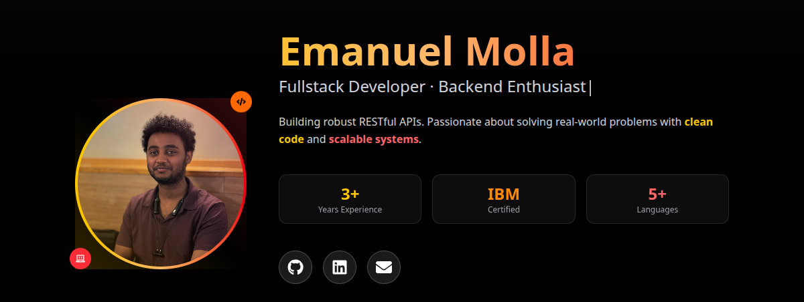

  

  

## 👨‍💻 About Me

Backend-focused full-stack developer studying Computer Systems Technology at BCIT. I build scalable web applications with clean, efficient code and love solving complex problems.

When I'm not coding, you'll find me playing chess ♟️ - always up for a game!

## 🚀 Current Projects

**🧠 DevNest** - Full-stack productivity app for developers  
*React • Node.js • Express • MongoDB*

**🌐 Portfolio** - Personal website showcasing my work  
*React • Tailwind CSS • Modern Design*

## 🛠️ Tech Stack

**Frontend**  

**Backend**  

**Database**  

**Tools**  

## 🎯 What's Next

- **📊 Data & Backend Project** - Building something data-intensive with PostgreSQL
- **🚀 Modern Backend Framework** - Exploring new technologies beyond Express
- **📝 Technical Blog** - Sharing insights and learning experiences

## ♟️ Fun Fact

I'm always up for a chess game - feel free to challenge me! It's a great way to think strategically, just like coding.

---

  <i>Let's build something amazing together!</i>

